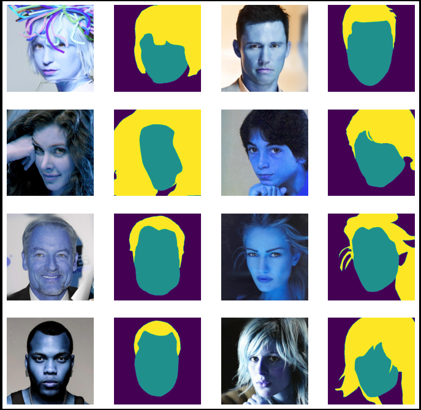

**This is a step-by-step guide to building and understanding semantic segmentation (multiclass version)**

- _By using celebAMask dataset, we'll try to segment the skin and hair._  
  **sample images after merging (face and hair) masks**:

  

This dataset will be used to create a segmentation.

Also, this was a **real world project** for a hair color production company in the early days of my career (on their own dataset)

---

_Link to the dataset can be found on [CelebAMask-HQ github](https://github.com/switchablenorms/CelebAMask-HQ)_

---
